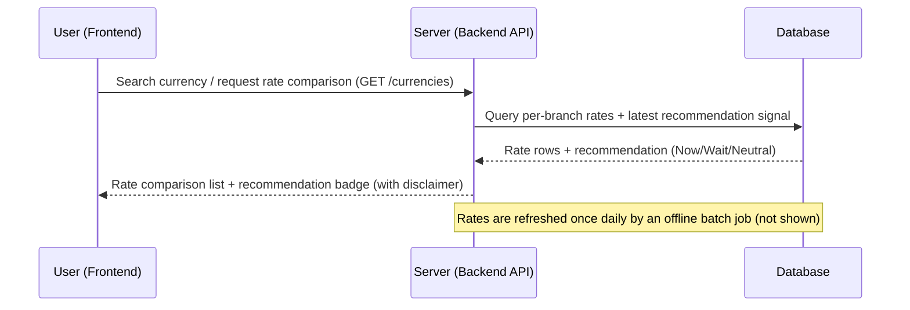
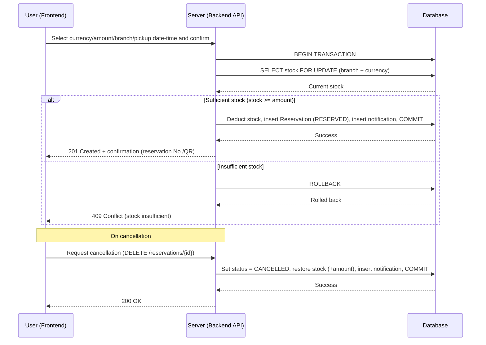

# TravelX — Sequence Diagrams (Mermaid source, EN)

> These are the exact Mermaid sources rendered to PNG and embedded into
> `TravelX_PRD_v1.1_EN.docx` §18 (Sequence Diagrams). Abstracted to three lanes only —
> User (Frontend) → Server (Backend) → Database. Notification writes are folded into the
> Server→Database step rather than shown as a separate service.
>
> A Korean-language version of these same flows (with additional batch/API context) lives in
> `PRD_Review_and_Changes.md` §3.

## 18.1 Exchange Rate Comparison

## 18.2 Currency Exchange Reservation

