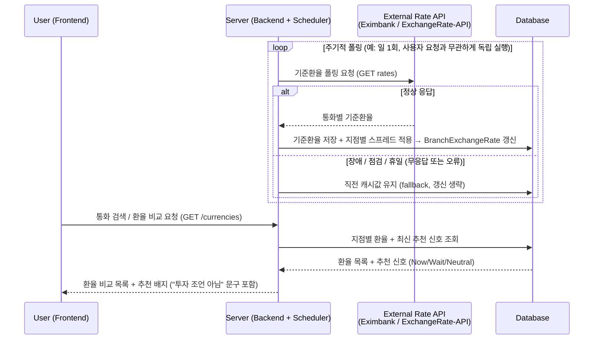
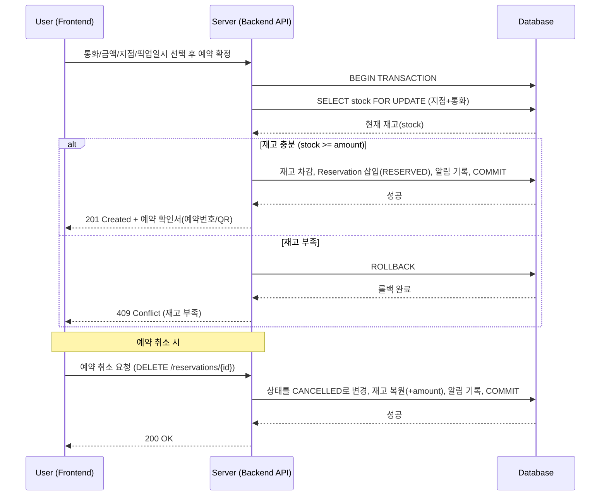
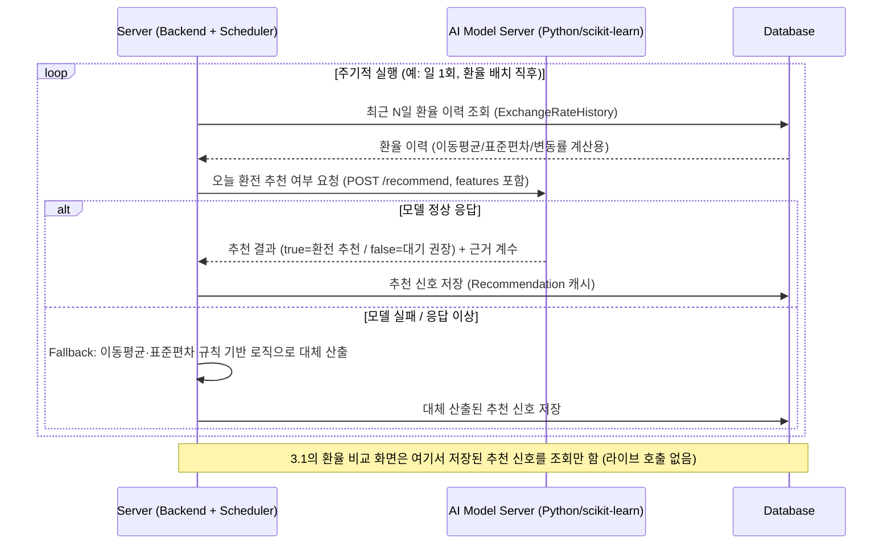

# TravelX PRD 검토 및 변경 제안 (v1.0 → v1.1)

> 작성: Business Analyst (AI) / 대상 문서: TravelX_PRD_v1.0_EN.docx
> 검토 배경(피드백 원문 요약):
> 1. 환율 API 연동 방식 검토
> 2. 8장 기능요구사항(Functional Requirements)의 Process 기술 타당성 확인
> 3. 핵심 기능(①환전 예약 ②환율 비교) 시퀀스 다이어그램 작성

---

## 1. 환율 API 연동 방식 검토

PRD 17장(Appendix)에 후보로 언급된 두 API의 실제 특성을 확인한 결과, 그대로 쓰기엔 몇 가지 전제가 PRD 본문(1.3, 7장 User Flow 등)의 "실시간" 표현과 충돌한다.

| 항목 | 한국수출입은행 Open API (data.go.kr) | ExchangeRate-API (exchangerate-api.com) |
|---|---|---|
| 갱신 주기 | **일 1회**(평일 11시경 고시) | **일 1회** (무료 플랜) |
| 실시간 여부 | ❌ 실시간 아님 | ❌ 실시간 아님 |
| 인증 | data.go.kr 인증키(authkey) 신청, 승인까지 지연 가능 | API Key 발급 (무료 티어 월 1,500 요청 제한) |
| 주말/공휴일 | 데이터 미제공 (직전 영업일자로 대체 조회 필요) | 제공되나 직전 값과 동일 |
| 제공 데이터 | 매매기준율/전신환매도·매입율/현찰매도·매입율, 약 40여개 통화 | 기준환율(mid-rate)만 제공, 매수/매도 스프레드 없음 |
| 과거 이력 조회 | 특정 일자 단건 조회만 가능(기간조회 API 없음 → 매일 배치로 직접 누적 필요) | 무료 플랜은 과거 데이터 미제공(유료 플랜 필요) |

### 발견된 문제
- **"Real-time exchange rate comparison"(1.3 Key Differentiators) 표현이 실제 데이터 특성과 불일치.** 두 후보 API 모두 일 1회 배치 갱신이므로, "실시간"이 아니라 **"매일 갱신되는 기준환율 기반 비교"** 로 문구 수정이 필요함.
- **"Compare rates across exchange offices"(FR-04)와 API 데이터 특성의 불일치.** 두 API 모두 국가/은행 단위의 단일 기준환율만 제공하며, "환전소(지점)별 환율"이라는 개념 자체가 API에 존재하지 않음. 즉 TravelX가 자체적으로 지점별 스프레드(마진)를 얹어 지점별 매수/매도율을 산정하는 구조가 되어야 하는데, 현재 12장 DB 설계(Currency 테이블)에는 이 구조가 반영되어 있지 않음 (2장에서 상세).
- 과거 이력 조회 API가 없으므로 9.2 "Exchange rate history loaded daily into own DB"는 필수 전제이며, 배치가 하루라도 실패하면 그날 이력이 영구 누락됨 → 재시도/백필(backfill) 로직 명시 필요.

### 권장 연동 아키텍처
1. **Primary**: 한국수출입은행 Open API — 매일 1회(예: 11:30 KST) Spring Scheduler 배치가 호출하여 통화별 기준환율(매매기준율)을 `ExchangeRateHistory`에 원본으로 저장.
2. **Fallback**: 위 배치 호출 실패(휴일/장애) 시 ExchangeRate-API를 2차 소스로 호출하거나, 직전 영업일 데이터를 그대로 유지(NFR 10장 "Batch stability"와 일치).
3. TravelX 서비스 자체 로직으로 지점별 매수/매도 스프레드(margin)를 기준환율에 적용해 `BranchExchangeRate`(신설 제안, 2장 참고)를 산출 — "환전소 간 비교"는 이 지점별 산출값을 비교하는 것으로 재정의.
4. 인증키 발급 리드타임(승인 지연 가능)을 고려해 Week 1(설계 단계)에 즉시 신청 착수 필요 — 개발 일정(15장) Week 1 작업 항목에 "환율 API 키 발급 신청" 추가 권장.

---

## 2. 기능요구사항(Functional Requirements) 기술 타당성 검토

8장 FR-01 ~ FR-15를 12장 DB 설계 및 14장 API 명세와 대조하여 검토함. **문제없음** 항목은 생략하고 이슈가 있는 항목만 정리.

| ID | 요구사항 | 타당성 검토 결과 | 필요 조치 |
|---|---|---|---|
| FR-04 | 환전소 간 환율 비교 | 🔴 **불일치**: `Currency` 테이블(12장)은 통화당 `buyRate`/`sellRate`가 **전역 1개**뿐이라 지점별 비교가 물리적으로 불가능 | `BranchExchangeRate`(branchId, currencyId, buyRate, sellRate) 테이블 신설, `GET /currencies` 응답에 지점별 값 포함되도록 API 명세 수정 |
| FR-05 | 통화/금액/지점/일시 지정 예약 | 🔴 **누락**: "Popular currencies frequently run out of stock"(3장 문제정의), "Manage currency inventory"(6.2 Admin) 를 지원할 **재고(stock) 필드가 DB 어디에도 없음**. 재고 없이는 10장 NFR "동시 예약 시 재고 초과 방지(락 처리)"도 구현 대상이 존재하지 않음 | 위 `BranchExchangeRate`(or 별도 `BranchCurrencyStock`)에 `stock` 컬럼 추가, 예약 생성 시 `SELECT ... FOR UPDATE` 비관적 락으로 재고 차감 |
| FR-06 | 예약 취소 | 🟡 취소 시 차감했던 재고를 복원(rollback)하는 로직이 명시되어 있지 않음 | "취소 시 stock += amount" 명문화 |
| FR-08 | 예약 확인서 발급 | 🟡 발급 형태(예약번호 텍스트 / QR코드 / PDF) 미정 — 6.3 "Present reservation confirmation"(현장 제시) 과 연결되려면 지점 직원이 스캔/조회할 식별자 형태가 필요 | MVP 범위: 예약번호 + QR코드(디코드 시 예약 ID) 형태로 확정 제안 |
| FR-09 | 예약완료/취소/픽업 임박 알림 | 🟡 (1) "Pre-pickup reminder"는 pickupDate/Time 기준 별도 스케줄러 트리거 필요(15장 개발 일정에 미반영). (2) `Notification` 테이블은 in-app 저장만 지원 — 이메일/푸시를 원한다면 SES/FCM 등 추가 인프라 필요, MVP에서는 in-app만으로 스코프 명시 필요 | 일정에 "픽업 리마인더 배치" 작업 추가, 알림 채널을 in-app으로 한정 명시 |
| FR-14 | 환율 이력 기반 타이밍 추천 | 🟡 서비스 오픈 초기 N일간은 학습 데이터 부족으로 신호 신뢰도가 낮음(9.3 로직은 "최근 N일" 데이터 전제) — 이 기간의 동작이 정의되어 있지 않음 | 최소 데이터 축적 기간(예: 14일) 미만이면 배지 미노출 또는 "데이터 수집 중" 상태로 고정하는 warm-up 정책 추가 |

### 종합 소견
FR-01/02/03/07/10~13/15는 현재 설계로 구현 가능. 다만 **FR-04·FR-05는 현재 DB 스키마로는 구현 불가능한 상태**이므로 우선순위 최상위로 스키마 보강이 필요함 (12장 개정안 별도 첨부 권장).

---

## 3. 핵심 기능 시퀀스 다이어그램

> 위 검토에서 제안한 `BranchExchangeRate`(지점별 환율+재고) 테이블 도입을 전제로 작성함.

> User(프론트)와 Server(백엔드), Database 3단계로만 추상화함. Notification 발송은 별도 참여자 없이 Server가 Database에 기록하는 단계로 통합. 단, **3.1은 외부 환율 API 연동 방식(폴링)을 명시적으로 보여주기 위해 External API 참여자를 예외적으로 추가**함 — 사용자 요청 경로와는 분리된, 서버 스케줄러 주도의 폴링 흐름이라는 점이 핵심.

### 3.1 환율 비교 (Exchange Rate Comparison) — FR-03, FR-04

> 사용자 요청마다 외부 API를 직접 호출하는 방식은 채택하지 않음(1장 검토 참고: 두 API 모두 일 1회만 갱신되므로 자주 호출해봐야 동일 값 반복 수신 + API 호출 한도만 소모 + 외부 장애가 곧 서비스 장애로 전이). 대신 **서버(스케줄러)가 주기적으로 외부 API를 폴링해 DB에 캐싱**하고, 사용자 요청은 항상 DB만 조회하도록 분리함.

### 3.2 환전 예약 (Currency Exchange Reservation) — FR-05, FR-06

### 3.3 AI 환율 타이밍 추천 (AI Exchange Timing Recommendation) — FR-14, 9.3

> 3.1의 "추천 배지"가 어디서 오는지를 보여주는 배경 흐름. Server(스케줄러)가 AI 모델 서버(13장 Tech Stack: Python/scikit-learn)에 "오늘 환전하기 좋은지"를 요청하고, **true(환전 추천) / false(대기 권장)** 형태의 응답을 받아 DB에 캐싱한다. 사용자 요청 경로(3.1)는 이 캐시만 조회하므로 AI 모델 서버 장애가 사용자 화면에 직접 영향을 주지 않는다.
>
> ⚠️ **확인 필요**: PRD 9.3은 "Exchange Now / Wait / Neutral" 3단계 신호를 전제로 하는데, true/false 이진 응답은 2단계뿐이라 **Neutral을 어디에 매핑할지 결정이 필요**함. (예안: false를 "Wait·Neutral 통합"으로 처리하거나, AI 서버가 true/false와 별도로 confidence score를 함께 반환해 Server가 임계값 기준으로 3단계로 재매핑)

---

## 4. 변경 제안 요약 (Action Items)

| 구분 | 변경 내용 | 관련 섹션 |
|---|---|---|
| 문구 수정 | "Real-time" → "일 1회 갱신되는 기준환율 기반" 으로 표현 정정 | 1.3, 7장 |
| DB 설계 추가 | `BranchExchangeRate`(branchId, currencyId, buyRate, sellRate, stock, updatedAt) 테이블 신설 | 12장 |
| API 명세 수정 | `GET /currencies` 응답에 지점(branch)별 환율·재고 포함 | 14장 |
| 일정 추가 | Week 1에 "환율 API 인증키 신청", Week 3에 "픽업 리마인더 배치" 작업 추가 | 15장 |
| 정책 정의 | FR-06 취소 시 재고 롤백, FR-14 AI 추천 warm-up 기간(최소 14일) 정의 | 8장, 9.3 |
| 스코프 명확화 | FR-08 확인서 형태(예약번호+QR), FR-09 알림 채널(in-app 한정) MVP 범위로 확정 | 6장, 8장 |

---

## 5. 외부 API 레퍼런스 링크

PRD 본문(1.3, 9.2, 11장, 16장, 17장)에서 언급된 외부 API를 실제 문서로 검증하여 링크를 첨부함. 17장 Appendix를 아래 내용으로 교체/보강할 것을 제안.

| API | 용도 (PRD 내 위치) | 공식 문서 | 비고 |
|---|---|---|---|
| ExchangeRate-API | 환율 fallback/보조 소스 (17장) | [ExchangeRate-API Docs - Overview](https://www.exchangerate-api.com/docs/overview) · [Free/Open Access](https://www.exchangerate-api.com/docs/free) | 무료 플랜은 일 1회 갱신 + 과거 이력 미제공(과거 이력은 Pro 플랜 이상 필요, [Historical Data Docs](https://www.exchangerate-api.com/docs/historical-data-requests)) |
| Google Maps Platform - Places API (Nearby Search) | "Google Maps-based nearby branch recommendations" (16장 Future Features) | [Nearby Search (New) 문서](https://developers.google.com/maps/documentation/places/web-service/nearby-search) | 아직 MVP 범위 밖(Future Feature)이므로 우선순위는 낮음. 실제 도입 시 API Key 발급 및 과금(사용량 기반) 정책 확인 필요 |

> 참고: "Online payment integration", "Digital wallet integration"(16장)은 특정 벤더/API가 아직 명시되지 않아 링크 대상에서 제외함. 실제 벤더(예: PG사, 특정 지갑사)가 정해지면 이 표에 추가 권장.

---

이 문서는 PRD v1.0 대비 변경 제안(diff) 초안이며, 승인 후 본 docx(v1.1)에 반영 예정.
