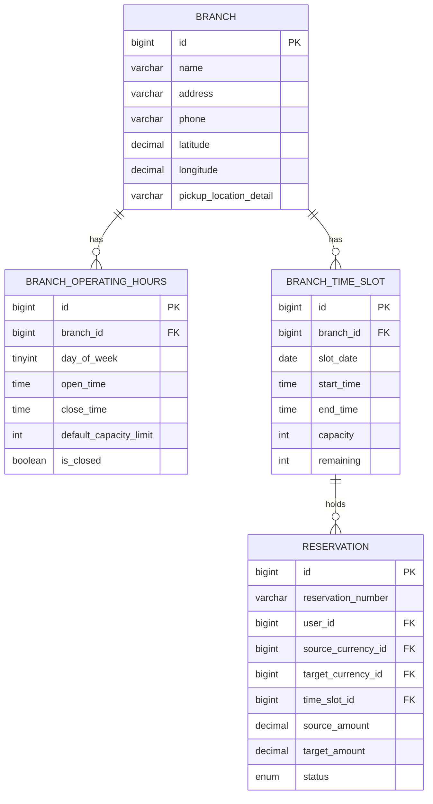
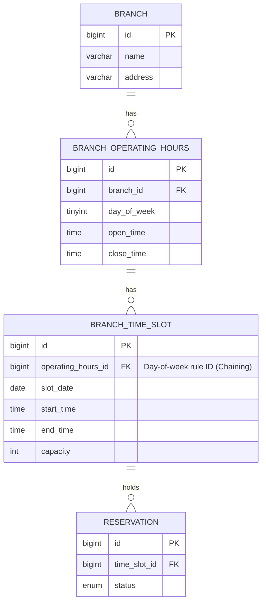

# Branch Operating Hours and Time-Slot Relationship Design: Comparative Analysis

---

## Background
* This discussion concerns advancing the branch operating-hours and 30-minute reservation-capacity control requirements from PRD [TravelX_PRD_v1.4.docx](../prd/TravelX_PRD_v1.4.docx) — **§12 (Database Design - Branch.businessHours)** draft design and **§19.3 (Time-Slot & Waiting Policy - Branch.timeSlotCapacity)** — into concrete database entities.

* We have completed the design of the branch (`BRANCH`), day-of-week operating hours (`BRANCH_OPERATING_HOURS`), and the materialized slot table that controls actual 30-minute reservation counts and locking (`BRANCH_TIME_SLOT`). What remains is a decision between two alternatives for how these three tables should be physically related (FK structure).

### Time-Control Domain ERD Under Review (Final Version Summary — Partial Excerpt)

---

## Option 1: Independent Separated Structure (Existing Design)
`BRANCH_OPERATING_HOURS` (day-of-week configuration guidelines) and `BRANCH_TIME_SLOT` (actual per-date reservation sessions) are each mapped as independent 1:N relationships under `BRANCH`.

### 1) Structure
* `BRANCH` is the parent, with the operating-hours configuration table and the actual time-slot table each connected directly as child tables.
* There is no physical foreign-key relationship between the two tables (operating hours, time slot); `BRANCH_TIME_SLOT` is managed independently via `branch_id` and `slot_date`.

### 2) Trade-offs
* **Pros**:
    - **Perfectly preserves the integrity (semantics) of past reservation history**: Even if the day-of-week operating-hours guideline (`HOURS`) is modified, it has no ripple effect on already-completed past reservation fact data (`SLOT`), so no accounting/transaction data distortion occurs.
* **Cons**:
    - When changing the time configuration for a specific date to find/cancel affected reservations, you cannot filter directly by the ID of the changed day-of-week configuration. Instead, you must write a join query with a composite condition on branch ID (`branch_id`), reservation date (`slot_date`), and the target time range (`start_time < :new_time`).

---

## Option 2: Hierarchical Chaining Structure
A hierarchical mapping structure that chains the 1:N relationships in sequence: `BRANCH` → `BRANCH_OPERATING_HOURS` → `BRANCH_TIME_SLOT`.

### 1) Structure
* `BRANCH_TIME_SLOT` is designed to directly reference, as a foreign key, the primary key (`operating_hours_id`) of the day-of-week operating-hours rule that the slot was generated from, instead of the branch ID (`branch_id`).

### 2) Trade-offs
* **Pros**:
    - **Simpler queries for finding cancellation targets**: When an admin pushes back the start time of a specific day-of-week rule (e.g., Monday rule ID `101`) from 7:00 to 11:00, the backend already has the target rule ID (`101`) at hand.
    - Therefore, without any complex time-range or branch-ID comparisons, the affected slots and their reservations can be found intuitively with just a 2-table join, using only `operating_hours_id = 101` and a specific date (`slot_date`) as conditions.
* **Cons**:
    - **Risk of retroactively distorting the meaning of historical data**: Even with a policy that blocks changes within 3 days of the target date (protecting near-future schedules), updating (`UPDATE`) the rule itself causes the business start time of **every past, already-completed reservation slot** that referenced that rule ID to be retroactively updated — producing data distortion (e.g., a pickup recorded as completed at 8:00 now appears to have happened before an 11:00 opening time).
    - **Bottleneck when introducing soft-delete**: To avoid this distortion, you could deactivate the existing record (`is_deleted=true`) and create a new rule (`INSERT`) instead of updating in place. But this means the FKs of all near-future slots within the 3-day window that already have active reservations (tomorrow, the day after, etc.) must be bulk-updated in real time to point to the new rule ID — creating a risk of heavy database write-lock contention and transaction conflicts.
    - **Contradiction in exception-schedule handling**: For exception slots that don't follow a regular operating rule (e.g., a one-off holiday closure), the parent rule ID field (`operating_hours_id`) would have to be force-mapped to an unnecessary null or a temporary dummy rule, undermining the model's consistency.

---

## Our Team's Thinking

Jihun: Under Option 1, the slot-generation batch scheduler has to go through `BRANCH_OPERATING_HOURS` to also learn `BRANCH`'s id, whereas under Option 2, the relationship can be set up directly using just `BRANCH_OPERATING_HOURS`'s own id — so Option 2 requires relatively less information to set up the relationship. Option 2 does carry a risk of historical data integrity errors, but I don't see whether preserving the integrity of past reservation history is actually an important business value here, nor a concrete problem that would arise from broken integrity given our current requirements — so I think Option 2 is reasonable.

Doohyun: I think managing tables independently, as in Option 1, is the semantically appropriate structure for maintaining data integrity. In Option 2, because the operating-hours table and the time-slot table are directly linked, a change to the operating-hours table risks distorting the historical records in the time-slot table. Handling that — either soft-deleting or outright deleting the affected historical records to match the change — carries a large technical cost and is inefficient. Hard-delete isn't even on the table since history could never be recovered afterward, and soft-delete requires adding an extra column plus bulk-update logic; that technical cost outweighs the benefit gained from choosing Option 2.

---

## Conclusion

Weighing the trade-offs of both options together, we currently lean toward Option 1 (independent separated structure).

Revisiting Option 2's core justification — "the batch scheduler can set up the relationship with less information" — `BRANCH_OPERATING_HOURS` already has a `branch_id` column, so the row the batch reads when generating a slot already contains both `id` (the FK for Option 2) and `branch_id` (the FK for Option 1). Either option costs the same: pulling one column out of a row you've already read. This justification alone isn't a reason to choose Option 2. If there's additional complexity in the batch logic that would overturn this, it needs to be verified separately.

Set that justification aside, and Option 2's three drawbacks (historical data distortion, bulk-UPDATE lock contention, contradictions in exception-slot handling) are all concrete and heavy, while Option 1's only drawback is that lookup queries need a composite condition and get a bit longer. In addition, since currency-exchange transactions are accounting data tied to tax reporting and KYC (PRD §21), we judged it unacceptable for a past, completed reservation record to be retroactively distorted by a later change to an operating-hours rule.

---

## Request for Feedback

We're currently leaning toward Option 1 — we'd like to know if there's a reason to go with Option 2, or some other structure instead.

---

## Related Documents
- [erd-specification.md](../prd/planning/erd-specification.md)
- [branch-time-slot-specification.md](../prd/planning/branch-time-slot-specification.md)
