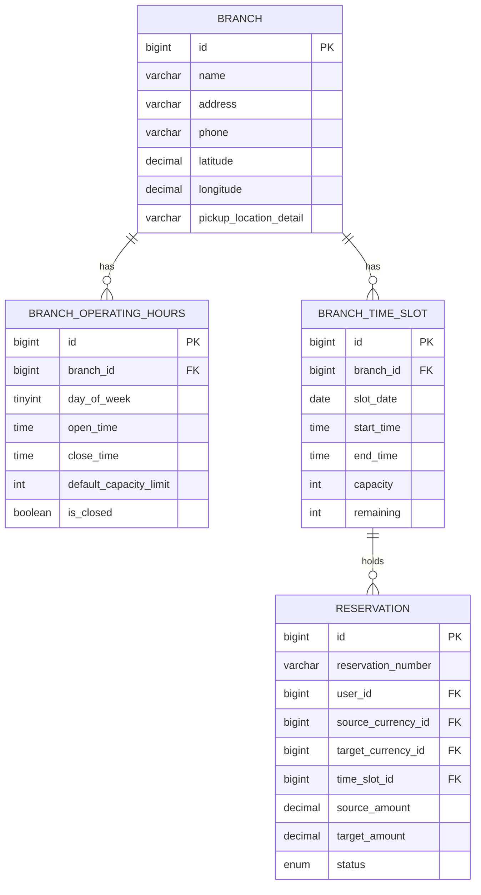
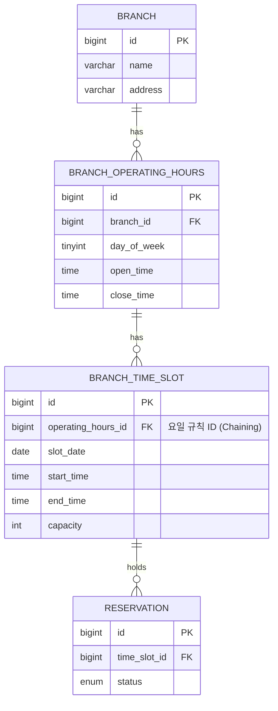

# 지점 운영 시간 및 타임슬롯 관계 설계 비교 분석서

---

## 배경
* PRD [TravelX_PRD_v1.4.docx](../prd/TravelX_PRD_v1.4.docx)의 **§12 (Database Design - Branch.businessHours)** 설계 초안 및 **§19.3 (Time-Slot & Waiting Policy - Branch.timeSlotCapacity)**의 지점 영업시간 및 30분 단위 예약 정원 제어 요건을 구체적인 데이터베이스 엔티티로 고도화하는 상황에 대한 논의임.

* 현재 지점(`BRANCH`), 요일별 영업시간(`BRANCH_OPERATING_HOURS`), 그리고 실제 30분 단위 예약자 수와 락을 제어할 실체화된 슬롯(`BRANCH_TIME_SLOT`) 테이블의 설계를 완료하였으나, 이 세 테이블 간의 물리적 연관관계(FK 구조) 맵핑 방식에 대한 두 가지 대안을 두고 의사결정이 필요함.

### 검토 중인 시간 제어 도메인 ERD (최종 버전 요약 - Diagram 중 일부만 발췌)

---

## 해결방안 1: 독립 분리 구조 (기존 설계안)
지점(`BRANCH`) 하위에 `BRANCH_OPERATING_HOURS`(요일별 설정 가이드라인)와 `BRANCH_TIME_SLOT`(실제 날짜별 예약 세션)을 각각 독립적인 1:N 관계로 맵핑하는 구조임.

### 1) 구조 설명
* 지점을 부모로 두고, 운영시간 설정 테이블과 실제 타임슬롯 테이블이 각각 자식 테이블로 직접 연결됨.
* 두 테이블(운영시간 테이블, 타임슬록 테이블)간에는 물리적인 외래 키(FK) 관계가 존재하지 않으며, `BRANCH_TIME_SLOT`은 `branch_id`와 `slot_date`를 통해 독립적으로 관리됨.

### 2) 트레이드 오프
* **장점**:
    - **과거 예약 이력의 정합성(Semantics) 완벽 보존**: 요일별 영업시간 가이드라인(`HOURS`)을 수정하더라도, 이미 수령 완료된 과거의 예약 사실 데이터(`SLOT`)에는 어떠한 파급 효과도 주지 않아 회계상 거래 데이터 왜곡이 발생하지 않음.
* **단점**:
    - 특정 날짜의 시간 설정을 변경하여 해당 구간의 예약자를 색출/취소할 때, 변경하려는 요일 설정의 ID로 다이렉트 필터링할 수 없고, 지점 ID(`branch_id`), 예약 날짜(`slot_date`), 대상 시간 범위(`start_time < :new_time`)를 복합 조건으로 명시해 조인 쿼리를 작성해야 함.

---

## 해결방안 2: 계층 체이닝 구조
`BRANCH` → `BRANCH_OPERATING_HOURS` → `BRANCH_TIME_SLOT` 순으로 1:N 관계를 연쇄적으로 Chaining하여 묶는 계층적 매핑 구조임.

### 1) 구조 설명
* `BRANCH_TIME_SLOT`이 지점 ID(`branch_id`) 대신, 해당 슬롯 생성의 기준이 된 요일별 운영 시간 규칙의 기본 키(`operating_hours_id`)를 외래 키(FK)로 직접 가리키도록 설계함.

### 2) 트레이드 오프
* **장점**:
    - **취소 대상 조회 쿼리의 간결함**: 어드민에서 특정 요일 규칙(예: 월요일 규칙 ID `101`)의 시작 시간을 7시에서 11시로 늦출 때, 백엔드에는 이미 변경 대상 규칙 ID(`101`)가 전달되어 있음.
    - 따라서, 복잡한 시간 범위나 지점 ID 비교 없이 `operating_hours_id = 101` 및 특정 날짜(`slot_date`) 조건만으로 취소 대상 슬롯과 예약자를 단 2개 테이블 조인만으로 직관적으로 찾아낼 수 있음.
* **단점**:
    - **과거 데이터의 의미 왜곡 위험**: 3일 전 변경 차단 정책을 적용하여 미래 일정은 보호하더라도, 규칙 자체를 수정(`UPDATE`)하는 경우 해당 규칙 ID를 가리키던 **과거 완료된 모든 예약 슬롯의 영업 시작 시각까지 소급 갱신**되는 데이터 왜곡(예: 11시 오픈인데 8시 수령 완료 기록)이 발생함.
    - **소프트 딜리트 도입 시의 병목**: 과거 왜곡 방지를 위해 규칙 변경 시 기존 레코드를 비활성화(`is_deleted=true`)하고 신규 규칙을 생성(`INSERT`)하는 우회책을 쓸 수 있음. 하지만 이 경우 이미 예약이 돌고 있는 3일 이내 단기 미래 슬롯(내일, 모레 등)들의 FK를 신규 규칙 ID로 일괄 실시간 갱신(`UPDATE`)해 주어야 하므로 대량의 데이터베이스 쓰기 락 병목 및 트랜잭션 충돌 위험이 생김.
    - **예외 스케줄 처리의 모순**: 운영 규칙에 얽매이지 않는 일시적 휴무일 등 예외 슬롯의 경우, 규칙 부모 ID(`operating_hours_id`) 필드에 불필요한 Null이나 임시 더미 규칙을 강제 맵핑해야 하므로 모델의 일관성이 훼손됨.

---

## 우리 팀의 생각

지훈: 방안 1은 슬롯 생성 배치가 BRANCH_OPERATING_HOURS를 거쳐 BRANCH의 id까지 알아야 하지만, 방안 2는 BRANCH_OPERATING_HOURS의 id만으로 바로 연관관계를 설정할 수 있어 상대적으로 적은 정보로 관계를 세팅할 수 있다고 생각한다. 방안 2는 과거 데이터 정합성 오류 위험이 있지만, 과거 예약 이력의 정합성을 유지하는 것이 비즈니스적으로 중요한 가치인지, 정합성이 깨졌을 때 실제로 발생할 문제가 우리 요구사항에서는 떠오르지 않아 방안 2가 타당하다고 생각한다.

두현: 방안 1처럼 테이블을 독립적으로 관리하는 구조가 데이터 정합성 유지에 더 적절하다고 생각한다. 방안 2는 operating hours와 time slot이 직접 연관되어 있어, operating hours 변경이 time slot의 과거 이력을 왜곡할 위험이 있다. 이를 막으려면 과거 이력을 soft-delete하거나 삭제해야 하는데 기술적 비용이 크고 비효율적이다. hard-delete는 히스토리 복구가 불가능해 고려 대상이 아니고, soft-delete도 컬럼 추가와 일괄 업데이트 로직이 필요해 그 비용이 방안 2를 선택함으로써 얻는 이득보다 크다고 생각한다.

---

## 결론

두 안의 트레이드오프를 종합하면 현재는 방안 1(독립 분리 구조) 쪽으로 기울어 있습니다.

방안 2의 핵심 근거였던 "배치 스케줄러가 더 적은 정보로 관계를 세팅할 수 있다"는 점을 다시 보면, `BRANCH_OPERATING_HOURS`에는 이미 `branch_id` 컬럼이 있어서 배치가 슬롯을 생성할 때 읽는 행 안에 `id`(방안 2용 FK)와 `branch_id`(방안 1용 FK)가 둘 다 들어 있습니다. 두 방안 모두 이미 읽은 행에서 컬럼 하나를 꺼내 쓰는 동일한 비용이라, 이 근거만으로는 방안 2를 선택할 이유가 되지 않습니다. 배치 로직에 이 판단을 뒤집을 추가 복잡성이 있다면 별도로 확인이 필요합니다.

이 근거를 빼면 방안 2의 단점 세 가지(과거 데이터 왜곡, 대량 UPDATE 락 병목, 예외 슬롯 처리 모순)는 구체적이고 무거운 반면, 방안 1의 단점은 조회 쿼리가 복합 조건이라 길어진다는 정도입니다. 또한 환전 거래는 세무 신고와 KYC(PRD §21)가 걸린 회계 데이터이므로, 과거 완료된 예약 기록이 운영시간 규칙 변경으로 소급 왜곡되는 것은 허용하기 어렵다고 판단했습니다.

---

## 의견 요청

저희는 방안 1로 기울어 있는데, 방안 2나 다른 구조를 택할 이유가 있는지 궁금합니다.

---

## 관련 문서
- [erd-specification.md](../prd/planning/erd-specification.md)
- [branch-time-slot-specification.md](../prd/planning/branch-time-slot-specification.md)
