# 데이터베이스 ERD 및 동시성 제어 설계 사양서

**담당**: AI 어시스턴트 · **상태**: 설계 완료
---

본 문서는 TravelX 프로젝트의 고도화된 관계형 데이터베이스 ERD 설계 및 각 도메인별 테이블, 연관관계, 필드 수준의 상세 사양을 명세함. 지점의 요일별 설정 관리, 30분 단위 타임슬롯 기반 동시성 제어, AI 기반 환율 추천 모델 및 배치 분석 데이터를 수용하기 위한 설계를 포괄함.

---

## 1. 개정 ERD 다이어그램 (Mermaid)

```mermaid
erDiagram
    USER {
        bigint id PK
        varchar name
        varchar email
        varchar password
        varchar google_id
        enum role
        varchar phone
        datetime created_at
        datetime updated_at
    }

    BRANCH {
        bigint id PK
        varchar name
        varchar address
        varchar phone
        decimal latitude
        decimal longitude
        varchar pickup_location_detail
        int time_slot_capacity
        datetime created_at
        datetime updated_at
    }

    BRANCH_OPERATING_HOURS {
        bigint id PK
        bigint branch_id FK
        tinyint day_of_week
        time open_time
        time close_time
        boolean is_closed
        datetime created_at
        datetime updated_at
    }

    BRANCH_TIME_SLOT_CONFIG {
        bigint id PK
        bigint branch_id FK
        tinyint day_of_week
        time start_time
        time end_time
        int capacity_limit
        boolean is_active
        datetime created_at
        datetime updated_at
    }

    BRANCH_TIME_SLOT {
        bigint id PK
        bigint branch_id FK
        date slot_date
        time start_time
        time end_time
        int capacity
        int remaining
        datetime created_at
        datetime updated_at
    }

    CURRENCY {
        bigint id PK
        varchar code
        varchar country
        decimal buy_rate
        decimal sell_rate
        datetime updated_at
    }

    BRANCH_CURRENCY_INVENTORY {
        bigint id PK
        bigint branch_id FK
        bigint currency_id FK
        decimal preferential_rate
        decimal reservation_only_stock
        datetime updated_at
    }

    RESERVATION {
        bigint id PK
        bigint user_id FK
        bigint currency_id FK
        bigint time_slot_id FK
        decimal amount
        enum status
        varchar qr_code
        decimal locked_rate
        datetime picked_up_at
        datetime created_at
        datetime updated_at
    }

    NOTIFICATION {
        bigint id PK
        bigint user_id FK
        enum type
        varchar message
        boolean is_read
        datetime created_at
    }

    RECOMMENDATION_SIGNAL {
        bigint id PK
        bigint currency_id FK
        enum signal_type
        int window_days
        decimal value
        datetime calculated_at
    }

    AI_RECOMMENDATION {
        bigint id PK
        bigint currency_id FK
        enum recommendation
        text rationale
        decimal confidence_score
        varchar model_version
        datetime generated_at
        datetime expires_at
    }

    AI_RECOMMENDATION_SIGNAL {
        bigint id PK
        bigint recommendation_id FK
        bigint signal_id FK
    }

    TOOL_CALL_LOG {
        bigint id PK
        bigint recommendation_id FK
        varchar tool_name
        json tool_input
        json tool_output
        datetime called_at
    }

    EXCHANGE_RATE_HISTORY {
        bigint id PK
        bigint currency_id FK
        decimal rate
        datetime recorded_at
    }

    BACKTEST_RESULT {
        bigint id PK
        bigint currency_id FK
        enum strategy_type
        date period_start
        date period_end
        int total_signals
        int correct_signals
        decimal accuracy_rate
        datetime created_at
    }

    NEWS_ARTICLE {
        bigint id PK
        varchar currency_code
        varchar title
        varchar source
        varchar url
        datetime published_at
        decimal sentiment_score
        datetime collected_at
    }

    MACRO_INDICATOR {
        bigint id PK
        varchar country_code
        varchar indicator_type
        decimal value
        date recorded_at
    }

    BRANCH ||--o{ BRANCH_OPERATING_HOURS : "has"
    BRANCH ||--o{ BRANCH_TIME_SLOT_CONFIG : "has"
    BRANCH ||--o{ BRANCH_TIME_SLOT : "has"
    BRANCH ||--o{ BRANCH_CURRENCY_INVENTORY : "has"
    CURRENCY ||--o{ BRANCH_CURRENCY_INVENTORY : "has"
    BRANCH_TIME_SLOT ||--o{ RESERVATION : "holds"
    USER ||--o{ RESERVATION : "makes"
    CURRENCY ||--o{ RESERVATION : "is_for"
    USER ||--o{ NOTIFICATION : "receives"
    CURRENCY ||--o{ RECOMMENDATION_SIGNAL : "has"
    CURRENCY ||--o{ AI_RECOMMENDATION : "has"
    AI_RECOMMENDATION ||--o{ AI_RECOMMENDATION_SIGNAL : "has"
    RECOMMENDATION_SIGNAL ||--o{ AI_RECOMMENDATION_SIGNAL : "has"
    AI_RECOMMENDATION ||--o{ TOOL_CALL_LOG : "has"
    CURRENCY ||--o{ EXCHANGE_RATE_HISTORY : "has"
    CURRENCY ||--o{ BACKTEST_RESULT : "has"
```



---

## 2. 도메인별 테이블 상세 사양 및 연관관계 설계 사유

### 1) 기준 정보 도메인 (USER, BRANCH, CURRENCY)

#### USER (서비스 회원)
* **설계 목적**: 일반 회원 및 지점 관리자 계정 정보를 관리함. 구글 OAuth2 연동 로그인 정보(`google_id`)와 본인 인증 및 리마인더 수신 연락처(`phone`)를 기록함.
* **연관관계 사유**: `RESERVATION` 및 `NOTIFICATION`과 1:N 관계를 맺어 회원이 생성한 예약 트랜잭션 기록과 시스템이 회원에게 전송한 알림 로그의 주체 무결성을 확보함.

| 필드명 | 타입 | 설명 및 비즈니스 의미 | 연관성 검증 및 예시 |
| :--- | :--- | :--- | :--- |
| **`id`** | bigint | 시스템 회원 식별 기본 키(PK)임. | `1001` |
| **`name`** | varchar | 회원의 실명(구글 프로필 동기화 등)임. | `'홍길동'` |
| **`email`** | varchar | 이메일 주소 및 로그인 식별자임. | `'gildong@gmail.com'` |
| **`password`** | varchar | 소셜 로그인 외 일반 가입용 단방향 해시 암호문임. | `'$2a$10$xyz...'` |
| **`google_id`** | varchar | 구글 OAuth2 연동 고유 서브젝트 ID임. | `'sub_123456789'` |
| **`role`** | enum | 사용자 권한 그룹임. | `'USER'`, `'ADMIN'` |
| **`phone`** | varchar | 알림톡 및 KYC 1단계 본인인증 완료 번호임. | `'+821012345678'` |

#### BRANCH (환전 지점)
* **설계 목적**: 환전 처리가 진행되는 실물 지점의 좌표, 설명 및 기본 타임슬롯 수용 제한 기준을 관리함.
* **연관관계 사유**: 지점의 요일별 설정(`OPERATING_HOURS`, `TIME_SLOT_CONFIG`), 실제 생성된 스케줄(`TIME_SLOT`), 그리고 보유 통화 현황(`BRANCH_CURRENCY_INVENTORY`)의 물리적 최상위 부모 엔티티 역할을 수행하여 지점 단위로 모든 설정을 제어함.

| 필드명 | 타입 | 설명 및 비즈니스 의미 | 연관성 검증 및 예시 |
| :--- | :--- | :--- | :--- |
| **`id`** | bigint | 지점 식별 기본 키(PK)임. | `1` |
| **`name`** | varchar | 지점의 대표 명칭임. | `'인천공항 T1 지점'` |
| **`address`** | varchar | 지점의 도로명 주소임. | `'인천 중구 공항로 272'` |
| **`phone`** | varchar | 지점 연락처임. | `'032-123-4567'` |
| **`latitude`** | decimal | 위치 추천 점수 계산용 위도임. | `37.460200` |
| **`longitude`** | decimal | 위치 추천 점수 계산용 경도임. | `126.440700` |
| **`pickup_location_detail`** | varchar | 수령처 위치(층, 게이트 등) 상세 기술임. | `'3층 Gate G 부근 TravelX 환전소'` |
| **`time_slot_capacity`** | int | 별도 슬롯 설정 없을 시 적용될 기본 수용량임. | `5` (30분당 기본 5건 예약 허용) |

#### CURRENCY (기준 통화)
* **설계 목적**: 시스템 표준 지원 통화 종류와 일일 벤치마크 고시 환율을 보관함 (→ [fx-data-model.md](./fx-data-model.md) 연계).
* **연관관계 사유**: `BRANCH_CURRENCY_INVENTORY` 및 `RESERVATION` 등 환율 정보가 개입되는 모든 핵심 거래 및 시그널 로그 테이블과 1:N으로 연결되어 통화 코드 데이터의 일관성을 제공함.

| 필드명 | 타입 | 설명 및 비즈니스 의미 | 연관성 검증 및 예시 |
| :--- | :--- | :--- | :--- |
| **`id`** | bigint | 통화 식별 기본 키(PK)임. | `5` |
| **`code`** | varchar | ISO 통화 코드 규격임. | `'VND'` |
| **`country`** | varchar | 사용 국가 명칭임. | `'베트남'` |
| **`buy_rate`** | decimal | 외부 연동 API 기준 고시 매입환율임. | `5.80` (100 VND 기준 원화) |
| **`sell_rate`** | decimal | 외부 연동 API 기준 고시 매출환율임. | `6.20` |

---

### 2) 시간 및 타임슬롯 제어 도메인 (OPERATING_HOURS, TIME_SLOT_CONFIG, TIME_SLOT)

#### BRANCH_OPERATING_HOURS (요일별 운영 시간 설정)
* **설계 목적**: 지점별 요일(월~일)의 시작/종료 시각 및 정기 휴무 여부를 설정하여 지점 영업 일정을 관리함.
* **연관관계 사유**: `BRANCH`와 1:N 연결을 맺어 지점마다 개별적인 주간 일정표를 가짐.

| 필드명 | 타입 | 설명 및 비즈니스 의미 | 연관성 검증 및 예시 |
| :--- | :--- | :--- | :--- |
| **`id`** | bigint | 요일 설정 식별 기본 키(PK)임. | `101` |
| **`branch_id`** | bigint | 소속 지점 식별 외래 키(FK)임. | `1` (인천공항 T1 지점과 매핑) |
| **`day_of_week`** | tinyint | 요일 코드임. | `1` (월요일) · *참고: 0(일) ~ 6(토)* |
| **`open_time`** | time | 영업 개시 시간임. | `'09:00:00'` |
| **`close_time`** | time | 영업 마감 시간임. | `'18:00:00'` |
| **`is_closed`** | boolean | 해당 요일의 정기 휴무 설정 플래그임. | `FALSE` (정상 영업) |

#### BRANCH_TIME_SLOT_CONFIG (요일별/시간별 정원 템플릿)
* **설계 목적**: 지점 관리자가 요일 단위로 특정 30분 시간대의 최대 수용 정원을 기본 정책(`time_slot_capacity`)과 다르게 세부 설정하기 위해 정의함.
* **연관관계 사유**: `BRANCH`와 1:N 연결을 맺어 지점의 예약 혼잡도를 특정 요일의 시간대별로 템플릿화하여 제어함.
* **Row 동작 예시**:
  - 데이터 형태: `day_of_week=1 (월요일), start_time='10:00', end_time='10:30', capacity_limit=8, is_active=TRUE`
  - 월요일 오전 10:00 ~ 10:30 타임슬롯은 기본값 5명이 아닌 8명으로 예약 정원이 템플릿화되어 관리됨.

#### BRANCH_TIME_SLOT (실체화된 날짜별 예약 타임슬롯)
* **설계 목적**: 스케줄러 배치가 매일 밤 작동하여 `OPERATING_HOURS` 및 `TIME_SLOT_CONFIG`를 토대로 3일 뒤의 30분 단위 실제 예약 시간대를 생성 및 적재하는 테이블임.
* **연관관계 사유**: `RESERVATION`과 1:N 관계를 맺어 예약이 해당 슬롯 세션에 귀속됨. `branch_id`와 직접 연결되어 지점별 조회를 빠르게 수행함.
* **Row 동작 예시**:
  - 예약 신청 시 해당 슬롯의 `remaining` (잔여 정원) 필드를 원자적으로 차감하여 동시성 오버부킹을 제어함 (→ [reservation-policy.md](./reservation-policy.md) 참고).
  - 데이터 형태: `id=5001, slot_date='2026-07-27', start_time='10:00', end_time='10:30', capacity=8, remaining=5`

---

### 3) 지점 재고 및 거래 도메인 (INVENTORY, RESERVATION, NOTIFICATION)

#### BRANCH_CURRENCY_INVENTORY (지점 통화 재고 및 우대율)
* **설계 목적**: 특정 지점이 보유한 통화의 실시간 수령 전용 재고량 및 지점 전용 우대 환율( preferential_rate )을 관리함 (→ [shop-inventory-policy.md](./shop-inventory-policy.md) 참고).
* **연관관계 사유**: `BRANCH` 및 `CURRENCY`와 다대다(M:N) 관계를 해소하는 매핑 테이블 역할을 수행함.

| 필드명 | 타입 | 설명 및 비즈니스 의미 | 연관성 검증 및 예시 |
| :--- | :--- | :--- | :--- |
| **`id`** | bigint | 인벤토리 식별 기본 키(PK)임. | `501` |
| **`branch_id`** | bigint | 지점 식별 외래 키(FK)임. | `1` (인천공항 T1 지점) |
| **`currency_id`** | bigint | 대상 통화 식별 외래 키(FK)임. | `5` (베트남 VND) |
| **`preferential_rate`** | decimal | 지점 고유의 수수료 우대 환율 조정값임. | `0.10` (우대 10% 적용) |
| **`reservation_only_stock`** | decimal | 모바일 앱 수령 전용 대기 재고 한도액임. | `30,000,000.00` |

#### RESERVATION (환전 수령 예약 거래)
* **설계 목적**: 사용자가 신청한 환전 거래 내역 및 상태, 현장 QR 승인 데이터를 추적함.
* **연관관계 사유**: `USER`, `CURRENCY`, `BRANCH_TIME_SLOT`과 N:1 관계로 연결되어 어떤 회원이 어떤 통화를 어느 시간대 슬롯에 예약했는지의 거래 무결성을 형성함.

| 필드명 | 타입 | 설명 및 비즈니스 의미 | 연관성 검증 및 예시 |
| :--- | :--- | :--- | :--- |
| **`id`** | bigint | 예약 트랜잭션 식별 기본 키(PK)임. | `202607150001` |
| **`user_id`** | bigint | 예약한 회원 식별 외래 키(FK)임. | `1001` |
| **`currency_id`** | bigint | 수령 타겟 외화 식별 외래 키(FK)임. | `5` (VND) |
| **`time_slot_id`** | bigint | 수령 일시 세션 식별 외래 키(FK)임. | `5001` (7월 27일 10:00 슬롯) |
| **`amount`** | decimal | 수령을 약속한 외화 신청 금액임. | `5000000.00` |
| **`status`** | enum | 거래 상태(PENDING, CONFIRMED, COMPLETED, CANCELLED)임. | `'CONFIRMED'` |
| **`qr_code`** | varchar | 지점 직원이 스캔하여 승인 처리할 QR 데이터임. | `'TX_QR_HASH_9918'` |
| **`locked_rate`** | decimal | 예약 확정 시점에 락인된 적용 환율임. | `5.79` |
| **`picked_up_at`** | datetime | 지점 직원이 QR 승인을 완료한 실제 수령 일시임. | `'2026-07-27 10:15:00'` |

#### NOTIFICATION (알림 발송 로그)
* **설계 목적**: 예약 알림, 환율 리마인더 등 사용자에게 전달된 메일/알림톡 발송 이력을 누적함.
* **연관관계 사유**: `USER`와 N:1 관계로 연결되어 특정 회원의 메시지 수신 내역을 식별함.

---

### 4) AI 예측 및 시장 데이터 분석 도메인

AI 알고리즘이 환율 트렌드를 예측하고 통계적 시그널을 계산하여 최종 거래 추천 정보를 생성 및 신뢰도 검증을 수행하기 위한 테이블 구조임.

```
[원천 및 가공 데이터]          [추천 결과 생성]               [신뢰도/도구 검증]
- NEWS_ARTICLE                 - AI_RECOMMENDATION           - TOOL_CALL_LOG
- MACRO_INDICATOR                     │                      - BACKTEST_RESULT
- EXCHANGE_RATE_HISTORY              ▼ (M:N 매핑)
                              - AI_RECOMMENDATION_SIGNAL
                                     ▲
                                     │
                              - RECOMMENDATION_SIGNAL (통계 시그널)
```

#### RECOMMENDATION_SIGNAL (통계 분석 시그널)
* **설계 목적**: 환율의 이동평균선(MA), 변동성 지표 등 정량적인 보조 지표 데이터를 산출하여 기록함.
* **연관관계 사유**: `CURRENCY`와 N:1 관계로 묶여 통화별 분석 데이터를 누적함.

#### AI_RECOMMENDATION (AI 환율 추천 결과)
* **설계 목적**: AI 모델이 종합 판단한 통화별 추천 등급(BUY, HOLD, SELL)과 정성적 근거 보고서를 보관함.

#### AI_RECOMMENDATION_SIGNAL (추천-시그널 매핑)
* **설계 목적**: AI 추천 결과가 어떤 정량적 시그널들(이동평균 등)을 근거로 도출되었는지를 N:M으로 연결하는 다대다 매핑 테이블임.

#### TOOL_CALL_LOG (에이전트 도구 호출 로그)
* **설계 목적**: AI 어시스턴트(LLM 에이전트)가 시장 데이터를 수집하거나 백테스트 분석 등을 위해 내부적으로 호출한 도구들의 입력/출력 JSON 데이터를 남김.
* **연관관계 사유**: `AI_RECOMMENDATION`과 N:1 관계로 연결되어 최종 리포트 생성 과정의 기술적 투명성을 추적함.

#### EXCHANGE_RATE_HISTORY (일별 환율 역사 이력)
* **설계 목적**: 통계 분석 스케줄러와 AI 모델의 학습을 위해 통화별 일일 고가/저가/종가 등 환율 변동 추이를 장기적으로 저장함.

#### BACKTEST_RESULT (AI 모델 정확도 평가)
* **설계 목적**: AI가 제시한 BUY/SELL 시그널의 실제 사후 적중률(`accuracy_rate`)을 계산하여 분석용 피드백 지표로 활용함.

#### NEWS_ARTICLE (해외 뉴스 및 오피니언 기사 데이터)
* **설계 목적**: 글로벌 외신 뉴스 기사를 크롤링하여 저장하고 감성 분석 모델을 통해 지수화(`sentiment_score`)함.

#### MACRO_INDICATOR (국가별 거시경제 지표)
* **설계 목적**: GDP 성장률, 금리, 인플레이션 등 국가별 거시경제 주요 선행 지표를 주기적으로 수집하여 저장함.

---

## 3. 동시성 제어 메커니즘 (Problem-Solving)

> "예약 정원이 5명 남은 인기 타임슬롯에 10명의 사용자가 동시에 예약 버튼을 누르는 경쟁 상황 시, 초과 예약(Overbooking)을 원천 차단하기 위한 DB 처리 사양임."

### 1) 동시성 제어 흐름 비교
* **분산 락 (Redis Redlock)**: 성능은 우수하나 추가 인프라 구축 및 장애 관리 비용 부담 발생.
* **비관적 락 (Pessimistic Lock)**: 타임슬롯 조회 시 `FOR UPDATE`를 수행하나, 슬롯 테이블은 날짜별로 30분 단위 레코드가 이미 실체화(`BRANCH_TIME_SLOT`)되어 있으므로 락 범위를 해당 30분 로우 레벨로 최소 격리할 수 있어 동시성 지연 영향도가 매우 적음.

### 2) 데이터베이스 처리 프로세스 (Atomic Update)
어플리케이션 단의 락 경쟁 코드 대신, 데이터베이스 레벨에서 원자적 갱신(Atomic Update)을 적용하여 정원 초과 실패를 가려냄.

1. 사용자가 예약 화면 진입 시 생성된 슬롯 레코드의 남은 정원(`remaining`) 확인.
2. 예약 버튼 클릭 시 하기 쿼리 실행 (원자적 차감):
   ```sql
   UPDATE branch_time_slot 
   SET remaining = remaining - 1 
   WHERE id = :slot_id 
     AND remaining > 0;
   ```
3. 영향받은 행(Affected Rows)의 결과에 따른 분기 처리:
   - **`1` 반환**: 정원 차감 성공. 트랜잭션을 이어서 진행하고 `RESERVATION` 레코드 생성 후 최종 커밋(`COMMIT`)함.
   - **`0` 반환**: 그 직전 동시에 다른 트랜잭션이 선점하여 `remaining > 0` 조건이 무너짐. 즉시 예약 불가 예외를 발생시키고 전체 트랜잭션을 롤백(`ROLLBACK`) 처리함.

---

## 관련 문서
- [fx-data-model.md](./fx-data-model.md)
- [reservation-policy.md](./reservation-policy.md)
- [shop-inventory-policy.md](./shop-inventory-policy.md)
- [branch-time-slot-specification.md](./branch-time-slot-specification.md)
- [branch-architecture-tradeoff.md](../discussion/branch-architecture-tradeoff.md)
