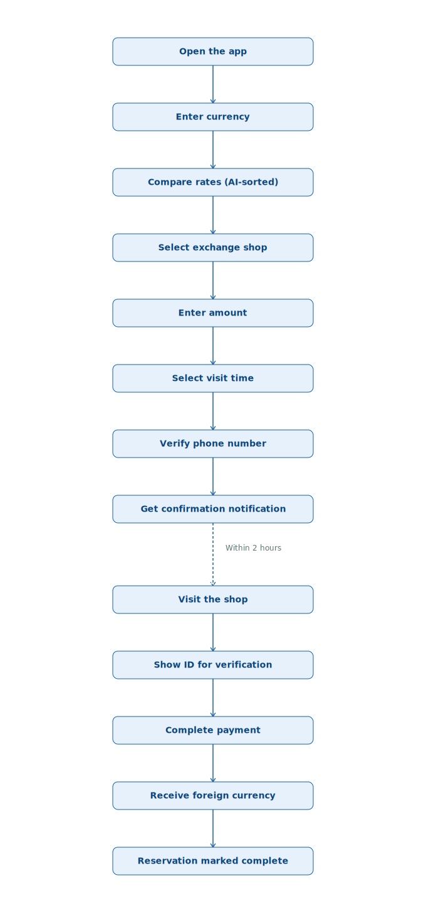
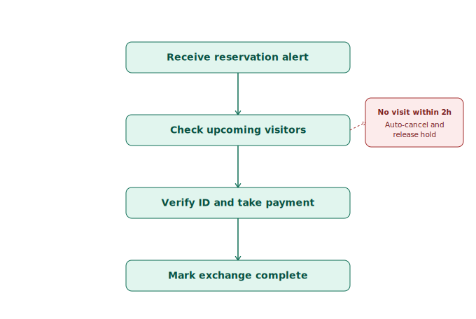
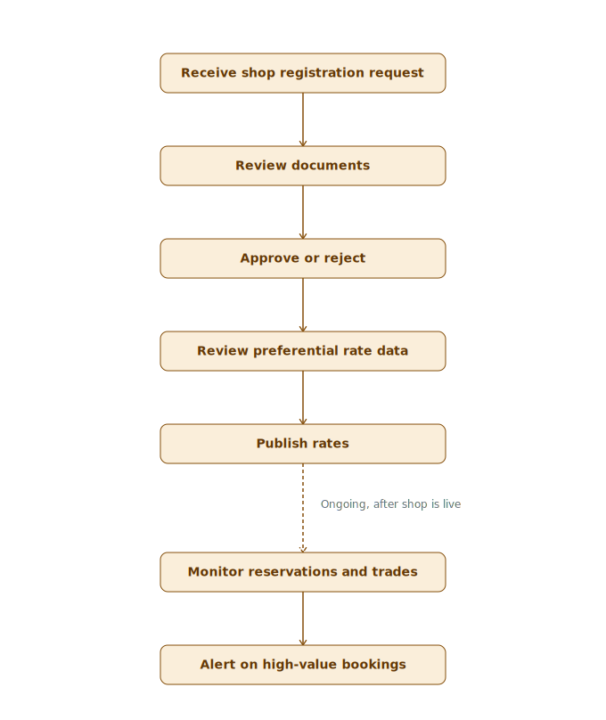

# User Flow
**담당**: 기획자 B · **상태**: 초안 (추후 다이어그램 이미지로 시각화 필요)

---

## Tourist Flow
```
앱 실행 → 통화/금액 입력 → 환율 비교 리스트 확인(AI 추천 정렬)
→ 환전소 선택 → 예약 정보 입력(방문 예정 시각) → 본인 인증(휴대폰)
→ 예약 완료 알림 수신 → [2시간 이내] 환전소 방문
→ 직원 신원확인(신분증) → 결제 → 외화 수령 → 예약 완료 처리
```


## Exchange Shop 직원 Flow
```
예약 알림 수신 → 예약 목록에서 방문 예정 고객 확인
→ 고객 방문 시 신분증으로 신원확인(KYC)
→ 결제(현장) → 재고에서 홀드 해제 및 실제 출고 처리
→ 환전 완료 상태로 변경 → (미방문 시) 2시간 후 자동 취소, 재고 홀드 해제
```


## Admin Flow
```
환전소 등록 신청 접수 → 서류 확인 → 승인/반려
→ 환전소별 우대율 데이터 검수 → 게시
→ 예약/거래 모니터링 → 고액 예약(1만달러 근접) 알림 확인
```


## 관련 문서
- [persona.md](./persona.md)
- [reservation-policy.md](./reservation-policy.md) — "2시간 후 자동 취소" 수치 일치 확인 필요
- [wireframe-requirements.md](./wireframe-requirements.md)
